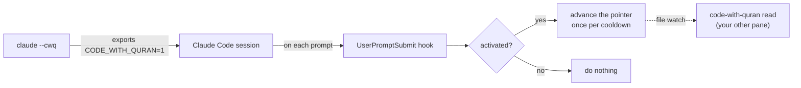

<div align="center">

# 📖 code-with-quran

**Read the Qur'an while Claude Code works.**

Keep a reader pane open next to your session. Start Claude with `claude --cwq`
and, as you work, the reader walks forward through the Qur'an an ayah at a
time — resuming from wherever you last left off.


</div>

---

Claude starts working, the ayah in your other pane moves forward, and you read a
few lines instead of watching a spinner. It stays in the terminal — no browser,
no context switch. The whole Uthmani text is bundled (~1.3 MB), so the reader is
instant and works offline.

```
                          Al-Baqarah · البقرة · The Cow · Medinan

              وَمَا خَلْفَهُمْ ۖ وَلَا يُحِيطُونَ بِشَىْءٍۢ مِّنْ عِلْمِهِۦٓ إِلَّا بِمَا شَآءَ ۚ
                        وَسِعَ كُرْسِيُّهُ ٱلسَّمَٰوَٰتِ وَٱلْأَرْضَ ۖ وَلَا يَـُٔودُهُۥ
                              حِفْظُهُمَا ۚ وَهُوَ ٱلْعَلِىُّ ٱلْعَظِيمُ ۝٢٥٥

                       █████████░░░░░░░░░░░  34.5%   2150 / 6236
                   j/k move · g goto · f follow · r reload · q quit
```

## Install

Node.js ≥ 18. No runtime dependencies.

```bash
git clone https://github.com/bahni-m/code-with-quran.git
cd code-with-quran
npm link                              # code-with-quran + cwq onto your PATH

code-with-quran shell-init --append   # add the `claude --cwq` wrapper to your shell
code-with-quran install               # add the Claude Code hook
source ~/.bashrc                       # or ~/.zshrc, or restart your shell
```

Both writers back up the file they touch (`*.bak-<timestamp>`).

## Using it day to day

**In tmux or zellij?** Nothing to set up — `claude --cwq` splits off a reader
pane for you. The first session opens it; later sessions reuse the same pane
(one reader, shared). `code-with-quran status` shows an `Autopane` line telling
you what it will do. Turn it off with `code-with-quran config autopane off`.

**Not in a multiplexer?** Open a reader in a pane you can see — a second
terminal, an editor terminal tab — and leave it there:

```bash
code-with-quran read
```

Then start your Claude sessions through the wrapper:

| Command | What happens |
| --- | --- |
| `claude --cwq` | the reader follows this session — each prompt nudges it forward (at most once every few minutes) |
| `claude --cwq-dgr` | same, plus `--dangerously-skip-permissions` |
| `claude` | the reader stays put; move it yourself with the keys below |

`--cwq` / `--cwq-dgr` must come first, before any other argument.

The reader assumes you read what it showed you, so the pointer only drifts if
you skim. Steer it any time:

| Key | Action |
| --- | --- |
| `j` / `→` / `space` | next ayah |
| `k` / `←` | previous ayah |
| `g` | go to a reference (`2:255`, `Al-Kahf`, `baqarah 255`) |
| `f` | toggle follow-mode (jump when the hook advances) |
| `r` | reload from disk |
| `q` / `Esc` | quit |

Away from the reader: `code-with-quran set 2:255` to reposition,
`code-with-quran now` to print the current ayah (handy in a tmux status line),
`code-with-quran status` for progress and activation state.

## Make it yours

Config lives in `~/.code-with-quran/config.json`; set values with
`code-with-quran config <key> <value>`.

| Key | Default | Meaning |
| --- | --- | --- |
| `ayatPerSession` | `1` | Ayat to advance per prompt. |
| `cooldownMinutes` | `3` | Minimum gap between advances, so a burst of quick prompts doesn't run you ahead several ayat. |
| `loop` | `true` | Wrap `114:6 → 1:1` instead of stopping at the end. |
| `enabled` | `true` | Master switch. `false` makes advancing a no-op (the reader still works manually). |
| `surface` | `tui` | Where an advance shows up: `tui`, `browser`, or `both`. |
| `autopane` | `auto` | Auto-open the reader pane on `claude --cwq`: `auto` splits a pane when you're in tmux or zellij, `off` never does, `tmux`/`zellij` pin it to one. |
| `source` | `quran.com` | Browser reader site — `quran.com`, `tanzil`, `quranwbw`, `alquran.cloud`. |
| `browser` | `""` | Explicit browser command. Empty = your OS default. |
| `browserArgs` | `""` | Extra arguments for that command. |

Prefer the browser to a terminal pane?

```bash
code-with-quran config surface browser   # open quran.com on each advance
code-with-quran config surface both      # reader pane *and* browser
```

## Turn it off

```bash
code-with-quran config enabled false   # pause advancing, keep everything installed
code-with-quran uninstall               # remove the Claude Code hook
code-with-quran shell-init --remove      # remove the shell wrapper
```

---

## How it works



Three moving parts:

1. **The shell wrapper** replaces `claude` with a small function. `claude --cwq`
   sets `CODE_WITH_QURAN=1` for that one invocation and runs the real binary via
   `command claude` — no recursion, and the variable never leaks into your
   shell. It also runs `code-with-quran open-pane --auto`, which splits off a
   reader pane when you're in tmux/zellij (`autopane`, default `auto`) and is an
   instant no-op otherwise. `shell-init` writes a `claude()` function for
   bash/zsh and a `function claude` for fish; `--shell=…` overrides the `$SHELL`
   guess.
2. **The hook** runs `code-with-quran open --quiet --session-only` on every
   `UserPromptSubmit`. `--session-only` makes it a no-op unless that variable is
   set. When it does run it advances the pointer in
   `~/.code-with-quran/state.json` — at most once per `cooldownMinutes` — and by
   default does nothing else (`surface = tui`).
3. **The reader** (`code-with-quran read`) watches `state.json` and jumps to the
   new ayah whenever the pointer moves — from the hook, or from another pane.
   Navigating with `j`/`k`/`g` writes the pointer back, so "where you are" stays
   consistent no matter what moved it.

## Commands

`cwq` is a short alias. `--json` on any command gives machine-readable output.

| Command | Description |
| --- | --- |
| `read` | Full-screen reader pane; follows the pointer |
| `open-pane` | Split off a reader pane (tmux / zellij) |
| `now` | Print the current ayah (Arabic + ref) |
| `open` *(default)* | Advance the pointer (+ browser if `surface` includes it) |
| `open --session-only` | No-op unless started via `claude --cwq` (the hook uses this) |
| `open --force` | Ignore the cooldown |
| `peek` | Print the current ayah + URL without advancing |
| `status` | Activation state, reader state, progress, config |
| `set <ref>` | Point at an ayah |
| `next [n]` / `back [n]` | Move the pointer without rendering |
| `reset` | Back to Al-Fatihah 1:1, counters cleared |
| `config [key] [value]` | Get / set configuration |
| `shell-init [--append \| --remove] [--shell=…]` | Manage the `claude` wrapper |
| `install` / `uninstall` | Manage the Claude Code hook |

## The Qur'an text

- `data/quran-uthmani.json` — the full Uthmani text, one entry per ayah (6236).
- `data/surahs.json` — 114 surahs: names (transliterated + Arabic), meanings,
  ayah counts, revelation place.

Text: **Tanzil Project** (Uthmani), CC BY 3.0, retrieved via
[alquran.cloud](https://alquran.cloud). See
[`data/QURAN-TEXT-LICENSE.txt`](data/QURAN-TEXT-LICENSE.txt). To rebuild:

```bash
curl -sS https://api.alquran.cloud/v1/quran/quran-uthmani -o /tmp/u.json
node scripts/build-quran-text.js /tmp/u.json
```

## Development

```bash
npm test          # node:test — no network, no browser, no rc files touched
```

| Module | Responsibility |
| --- | --- |
| `quran.js` | Surah metadata, progression maths (advance/rewind, reference parsing, URLs) |
| `quran-text.js` | Uthmani text lookup |
| `render.js` | Pure frame builder for the reader (width-aware Arabic wrapping) |
| `tui.js` | The reader loop: raw input, state-file watch, alt-screen |
| `pane.js` | Split a reader pane in tmux / zellij (deduped) |
| `state.js` / `config.js` | JSON persistence under `~/.code-with-quran/` |
| `session.js` | The `CODE_WITH_QURAN` activation gate |
| `reader-registry.js` | Heartbeat file so `status` knows a reader is running |
| `open.js` | Cross-platform browser launch |
| `shell.js` | Wrapper generation + rc-file editing |
| `hook.js` | Claude Code `settings.json` install / uninstall |
| `index.js` | Orchestration |

## License

Code: [MIT](LICENSE). Qur'an text: CC BY 3.0 (Tanzil Project).
