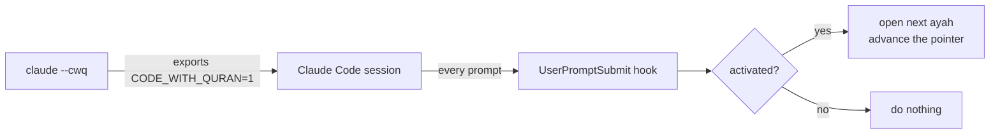

<div align="center">

# 📖 code-with-quran

**Read the Qur'an while Claude Code works.**

Start a session with `claude --cwq` and every prompt you send opens the next
ayah in your browser — resuming from wherever you last left off.


</div>

---

Claude starts working, a tab opens at your next ayah, and you read a few lines
instead of watching a spinner. On a plain `claude` — without `--cwq` — nothing
happens at all.

It keeps one pointer (`surah:ayah`) on disk. Each open shows the current
position, then advances by one ayah, crossing surah boundaries and wrapping
from An-Nas back to Al-Fatihah when you finish the whole Qur'an.

```
$ code-with-quran status
Activation ON  (this session was started with --cwq)
Position   Al-Baqarah 2:255  (The Cow)
Progress   [########----------------] 34.5%  2150/6236 ayat
Opens      41  (total 41)
Source     quran.com
```

## Quickstart

Node.js ≥ 18. No runtime dependencies.

```bash
git clone https://github.com/bahni-m/code-with-quran.git
cd code-with-quran
npm link                              # code-with-quran + cwq onto your PATH

code-with-quran shell-init --append   # add the `claude --cwq` wrapper to your shell
code-with-quran install               # add the Claude Code hook
source ~/.bashrc                       # or ~/.zshrc, or restart your shell
```

Both writers back up the file they touch first (`*.bak-<timestamp>`).

Then start your sessions like this:

| Command | Effect |
| --- | --- |
| `claude --cwq` | Qur'an enabled for this session |
| `claude --cwq-dgr` | same, plus `--dangerously-skip-permissions` |
| `claude` | untouched — code-with-quran stays silent |

`--cwq` / `--cwq-dgr` must be the **first** argument.

## How it works



**The shell wrapper** replaces `claude` with a small function. `claude --cwq`
sets `CODE_WITH_QURAN=1` for that one invocation and then runs the real binary
via `command claude` (no recursion, no leak into your shell).

```sh
claude() {
  case "${1:-}" in
    --cwq)     shift; CODE_WITH_QURAN=1 command claude "$@" ;;
    --cwq-dgr) shift; CODE_WITH_QURAN=1 command claude --dangerously-skip-permissions "$@" ;;
    *)         command claude "$@" ;;
  esac
}
```

**The hook** runs `code-with-quran open --quiet --session-only` on every
`UserPromptSubmit`. `--session-only` makes it a no-op unless that environment
variable is set — so the hook is inert until you opt in with `--cwq`.

`shell-init` detects your shell from `$SHELL`; override with
`--shell=bash|zsh|fish`. fish gets a `function claude` equivalent.

## Commands

`cwq` is a short alias. `--json` on any command gives machine-readable output.

| Command | Description |
| --- | --- |
| `open` *(default)* | Open the current ayah, then advance the pointer |
| `open --force` | Ignore the cooldown |
| `open --dry-run` | Show what would happen; open nothing, save nothing |
| `peek` | Print the current ayah + URL — no open, no advance |
| `status` | Activation state, progress, open count, config |
| `set <ref>` | Point at an ayah — `2:255`, `Al-Kahf`, `baqarah 255` |
| `next [n]` / `back [n]` | Move the pointer without opening a browser |
| `reset` | Back to Al-Fatihah 1:1, counters cleared |
| `config [key] [value]` | Get or set configuration |
| `shell-init [--append \| --remove]` | Manage the `claude` wrapper |
| `install` / `uninstall` | Manage the Claude Code hook |

## Configuration

Stored in `~/.code-with-quran/config.json`.

| Key | Default | Meaning |
| --- | --- | --- |
| `enabled` | `true` | Master switch. `false` makes `open` a no-op even when activated. |
| `ayatPerSession` | `1` | How many ayat to advance per open. |
| `cooldownMinutes` | `3` | Minimum gap between opens, so rapid prompts don't spawn tabs. |
| `loop` | `true` | Wrap `114:6 → 1:1` instead of stopping at the end. |
| `source` | `quran.com` | Reader site: `quran.com`, `tanzil`, `quranwbw`, `alquran.cloud`. |
| `browser` | `""` | Explicit browser command. Empty = your OS default. |
| `browserArgs` | `""` | Extra arguments for that command. |

```bash
code-with-quran config ayatPerSession 3
code-with-quran config source tanzil
code-with-quran config cooldownMinutes 10
```

It can't know which ayah you actually stopped on, so it assumes you read what it
showed you. If the pointer drifts, `code-with-quran set 2:255` puts it back.

## Uninstall

```bash
code-with-quran uninstall             # remove the hook
code-with-quran shell-init --remove   # remove the wrapper
```

## Data

`data/surahs.json` — all 114 surahs with transliterated and Arabic names,
meanings, and ayah counts (standard Ḥafṣ / Kūfan numbering, 6236 ayat total).
Regenerate with `npm run build-data`.

## Development

```bash
npm test          # node:test — no network, no browser, no rc files touched
```

`src/` is split so each piece stands alone:

| Module | Responsibility |
| --- | --- |
| `quran.js` | Surah metadata and progression maths (advance, rewind, reference parsing, URLs) |
| `state.js` / `config.js` | JSON persistence under `~/.code-with-quran/` |
| `session.js` | The `CODE_WITH_QURAN` activation gate |
| `open.js` | Cross-platform browser launch |
| `shell.js` | Wrapper generation and rc-file editing |
| `hook.js` | Claude Code `settings.json` install / uninstall |
| `index.js` | The `open` orchestration |

## License

[MIT](LICENSE)
