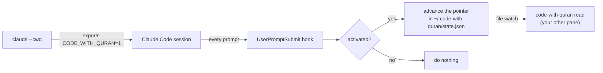

<div align="center">

# 📖 code-with-quran

**Read the Qur'an while Claude Code works.**

Keep a reader pane open next to your session. Start Claude with `claude --cwq`
and every prompt you send advances the reader one ayah — resuming from wherever
you last left off.


</div>

---

Claude starts working, the ayah in your other pane moves forward, and you read a
few lines instead of watching a spinner. It stays in the terminal — no browser,
no context switch. On a plain `claude` (without `--cwq`), nothing moves.

The whole Uthmani text is bundled (Tanzil Project, ~1.3 MB), so the reader works
offline and instantly.

```
                          Al-Baqarah · البقرة · The Cow · Medinan

              وَمَا خَلْفَهُمْ ۖ وَلَا يُحِيطُونَ بِشَىْءٍۢ مِّنْ عِلْمِهِۦٓ إِلَّا بِمَا شَآءَ ۚ
                        وَسِعَ كُرْسِيُّهُ ٱلسَّمَٰوَٰتِ وَٱلْأَرْضَ ۖ وَلَا يَـُٔودُهُۥ
                              حِفْظُهُمَا ۚ وَهُوَ ٱلْعَلِىُّ ٱلْعَظِيمُ ۝٢٥٥

                       █████████░░░░░░░░░░░  34.5%   2150 / 6236
                   j/k move · g goto · f follow · r reload · q quit
```

## Quickstart

Node.js ≥ 18. No runtime dependencies.

```bash
git clone https://github.com/bahni-m/code-with-quran.git
cd code-with-quran
npm link                              # code-with-quran + cwq onto your PATH

code-with-quran shell-init --append   # add the `claude --cwq` wrapper to your shell
code-with-quran install               # add the Claude Code hook
source ~/.bashrc                       # or ~/.zshrc, or restart your shell
```

Both writers back up the file they touch (`*.bak-<timestamp>`).

Then, in day-to-day use:

```bash
code-with-quran read     # in a second pane / tmux split — leave it open
claude --cwq             # your session; each prompt advances the reader
```

| Start command | Effect |
| --- | --- |
| `claude --cwq` | reader follows this session |
| `claude --cwq-dgr` | same, plus `--dangerously-skip-permissions` |
| `claude` | untouched — nothing advances |

`--cwq` / `--cwq-dgr` must be the **first** argument.

## How it works



Three moving parts:

1. **The shell wrapper** replaces `claude` with a small function. `claude --cwq`
   sets `CODE_WITH_QURAN=1` for that one invocation and runs the real binary via
   `command claude` (no recursion, no leak into your shell).
2. **The hook** runs `code-with-quran open --quiet --session-only` on every
   `UserPromptSubmit`. `--session-only` makes it a no-op unless that variable is
   set. It advances the pointer in `state.json` and, by default, does nothing
   else (`surface = tui`).
3. **The reader** (`code-with-quran read`) watches `state.json` and jumps to the
   new ayah whenever the pointer moves — from the hook, or from another pane.

The reader can't know which ayah you actually stopped on, so it assumes you read
what it showed. Navigate with `j`/`k` or `g` and the pointer follows you.

### Reader keys

| Key | Action |
| --- | --- |
| `j` / `→` / `space` | next ayah |
| `k` / `←` | previous ayah |
| `f` | toggle follow-mode (jump when the hook advances) |
| `g` | go to a reference (`2:255`, `Al-Kahf`, `baqarah 255`) |
| `r` | reload from disk |
| `q` / `Esc` | quit |

## Prefer a browser?

```bash
code-with-quran config surface browser   # open quran.com on each advance instead
code-with-quran config surface both      # reader pane *and* browser
code-with-quran config source tanzil     # quran.com | tanzil | quranwbw | alquran.cloud
```

## Commands

`cwq` is a short alias. `--json` on any command gives machine-readable output.

| Command | Description |
| --- | --- |
| `read` | Full-screen reader pane; follows the pointer |
| `now` | Print the current ayah (Arabic + ref) — for tmux/statuslines |
| `open` *(default)* | Advance the pointer (+ browser if `surface` includes it) |
| `open --session-only` | No-op unless started via `claude --cwq` (the hook uses this) |
| `open --force` | Ignore the cooldown |
| `peek` | Print the current ayah + URL without advancing |
| `status` | Activation state, reader state, progress, config |
| `set <ref>` | Point at an ayah |
| `next [n]` / `back [n]` | Move the pointer without rendering |
| `reset` | Back to Al-Fatihah 1:1, counters cleared |
| `config [key] [value]` | Get / set configuration |
| `shell-init [--append \| --remove] [--shell=…]` | Manage the `claude` wrapper |
| `install` / `uninstall` | Manage the Claude Code hook |

## Configuration

Stored in `~/.code-with-quran/config.json`.

| Key | Default | Meaning |
| --- | --- | --- |
| `enabled` | `true` | Master switch. `false` makes `open` a no-op even when activated. |
| `ayatPerSession` | `1` | Ayat to advance per prompt. |
| `cooldownMinutes` | `3` | Minimum gap between advances, so rapid prompts don't skip ahead. |
| `loop` | `true` | Wrap `114:6 → 1:1` instead of stopping at the end. |
| `surface` | `tui` | Where an advance surfaces: `tui`, `browser`, or `both`. |
| `source` | `quran.com` | Browser reader site (when `surface` includes browser). |
| `browser` | `""` | Explicit browser command. Empty = your OS default. |
| `browserArgs` | `""` | Extra arguments for that command. |

## Uninstall

```bash
code-with-quran uninstall             # remove the hook
code-with-quran shell-init --remove   # remove the wrapper
```

## Data

- `data/surahs.json` — 114 surahs: names (transliterated + Arabic), meanings,
  ayah counts, revelation place.
- `data/quran-uthmani.json` — the full Uthmani text, one entry per ayah
  (6236 total).

Qur'an text: **Tanzil Project** (Uthmani), CC BY 3.0, retrieved via
[alquran.cloud](https://alquran.cloud). See
[`data/QURAN-TEXT-LICENSE.txt`](data/QURAN-TEXT-LICENSE.txt). Rebuild:

```bash
curl -sS https://api.alquran.cloud/v1/quran/quran-uthmani -o /tmp/u.json
node scripts/build-quran-text.js /tmp/u.json
```

## Development

```bash
npm test          # node:test — no network, no browser, no rc files touched
```

| Module | Responsibility |
| --- | --- |
| `quran.js` | Surah metadata, progression maths (advance/rewind, reference parsing, URLs) |
| `quran-text.js` | Uthmani text lookup |
| `render.js` | Pure frame builder for the reader (width-aware Arabic wrapping) |
| `tui.js` | The reader loop: raw input, state-file watch, alt-screen |
| `state.js` / `config.js` | JSON persistence under `~/.code-with-quran/` |
| `session.js` | The `CODE_WITH_QURAN` activation gate |
| `reader-registry.js` | Heartbeat file so `status` knows a reader is running |
| `open.js` | Cross-platform browser launch |
| `shell.js` | Wrapper generation + rc-file editing |
| `hook.js` | Claude Code `settings.json` install / uninstall |
| `index.js` | Orchestration |

## License

Code: [MIT](LICENSE). Qur'an text: CC BY 3.0 (Tanzil Project).
